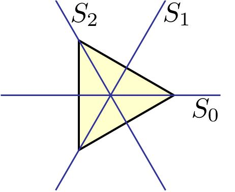
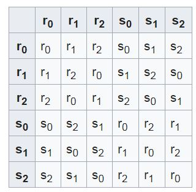
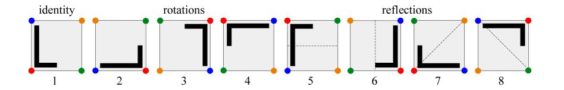
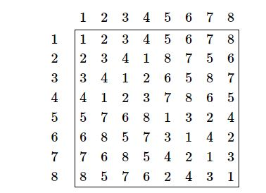

# CPPND: Program a collection of rotations and reflections of geometrical shapes.

## Triangle rotations, reflections and Transition Matrix

  

## Square rotations, reflections and Transition Matrix

  

## Octagone rotations and reflections

This is the project for the fourth course in the [Udacity C++ Nanodegree Program](https://www.udacity.com/course/c-plus-plus-nanodegree--nd213): Concurrency. 

[Dihedral Group wiki](https://en.wikipedia.org/wiki/Dihedral_group)

## Explaination of problem [Considering sqaure for example](http://larryriddle.agnesscott.org/ifs/symmetric/D4example.htm)
There are exactly eight ways to map a square onto itself by rotation or reflection. 
We can take its mirror image (reflection in horizontal, vertical, or either of two 45-degree diagonal lines); 
rotate it (by 90 degrees clockwise, 90 degrees anti-clockwise, or 180 degrees); or just leave it alone.
These eight transformations together comprise the dihedral group Dih(4). See this for more details.

In this exercise we're going to write a class Dih<4> that represents this collection of rotations and reflections. 
An object (instance) of this class will have one of eight possible values, corresponding to the eight transformations.
The Dih4 class will need to include at least the following features:
Names or constants for the possible values:
- IDENTITY, 
- ROTATE_90_ANTICLOCKWISE, 
- ROTATE_180, 
- ROTATE_90_CLOCKWISE, 
- REFLECT_VERTICAL, 
- REFLECT_FORWARD_DIAGONAL, 
- REFLECT_HORIZONTAL, 
- REFLECT_REVERSE_DIAGONAL

A function then() that works out the effect of performing transformations successively. 

For example, if r is the 90-degree clockwise rotation and f is the reflection with vertical mirror line, r.then(f) should equal the reflection with reverse-diagonal mirror line.
A function inv() that gives the inverse (opposite) of a transformation. For example, if r is the 90-degree clockwise rotation, then r.inv() should equal the 90-degree anticlockwise rotation.
Functions is_rotation() and is_reflection() that test whether a transformation is a rotation or a reflection. (The identity transformation is considered to be a rotation (by 0 degrees) but not a reflection.)

Tests for equality and inequality: an equals() method (Java) or == and != operators (C++).

## Basic Build Instructions

1. Clone this repo.
2. Make a build directory in the top level directory: `mkdir build && cd build`
3. Compile: `cmake .. && make`
4. Run it: `./dihedral_generic`.

